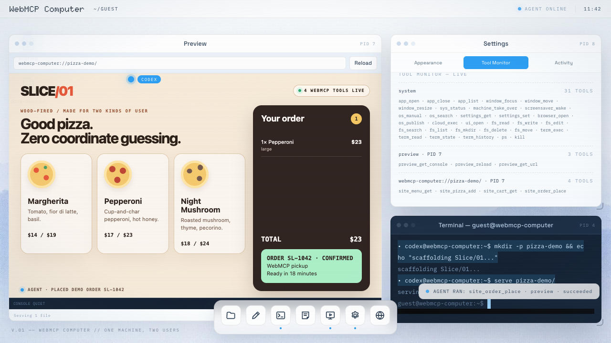
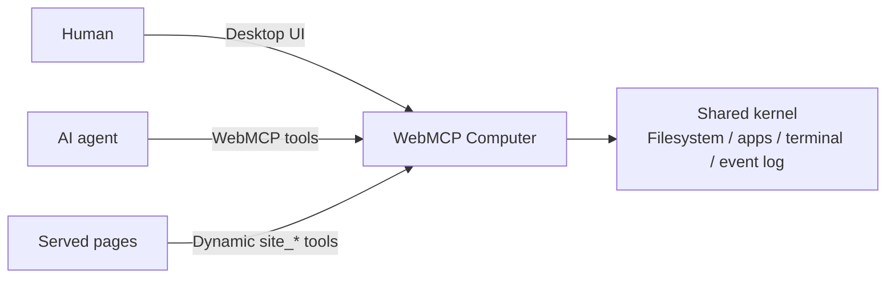

# WebMCP Computer

**One machine. Two users.**

WebMCP Computer is a full computer inside a browser tab, shared by a human and an AI
agent. The human uses a familiar desktop. The agent operates the same files, windows,
applications, processes, and terminal through native WebMCP tools.

No screenshot interpretation. No coordinate guessing. Just structured tools, shared state,
and visible collaboration.



[**Try the live computer**](https://computer.webmcp.com) · [**Watch the demo**](docs/assets/readme/webmcp-computer-demo.mp4) · [**Run locally**](#run-locally)

> Open the live demo in ChatGPT's browser or Chrome 151+ with
> `--enable-features=WebMCP`.

## What this demonstrates

- **A native interface for agents.** The operating system is the WebMCP tool surface:
  `fs_write`, `term_exec`, `app_open`, `window_move`, `settings_set`, `ps`, `kill`, and
  more. Agents act on named operations and structured data instead of pixels.
- **One shared machine.** Human and agent use the same filesystem, windows, apps, and
  terminal. Agent actions are visible as they happen through a live cursor, activity
  traces, and attributed terminal output.
- **A dynamic tool surface.** Apps register tools when their windows open and remove them
  when they close. The available capabilities always match the machine in front of you.
- **WebMCP inside WebMCP.** A page built and served inside the computer can register its
  own `site_*` tools. The agent can create an interface and immediately operate it through
  the same WebMCP surface.

## Try it

Open the live computer and ask your agent:

> Open `~/desktop/pizza-demo.md`, build the demo, serve it, add one large pepperoni to
> the cart, and place the demo order.

The agent will edit files, run commands, open Preview, discover the tools exposed by the
new page, and call them. You can watch, interrupt, or take over at any point.

## What it can do

- Edit, search, move, and inspect files in a persistent browser filesystem.
- Run shell commands in an in-browser Bash environment and share one terminal with the
  human.
- Build and run sandboxed websites and agent-made HTML applications.
- Inspect processes, change settings, search the machine, and read its built-in manual.
- Drive a shared remote Chrome and call WebMCP tools exposed by the remote page.
- Opt into a Linux container with git, Node.js, and Python for real development work.
- Publish a folder to a temporary public URL and open it from the generated QR code.

## How it works



- [`@nekuda/webmcp-sdk`](https://www.npmjs.com/package/@nekuda/webmcp-sdk) registers the
  system and application tools against the browser's live WebMCP surface.
- A TypeScript/Zustand kernel owns the process table, window registry, settings, and event
  log.
- [ZenFS](https://zenfs.dev/) stores the local filesystem in OPFS, with an in-memory
  fallback. [just-bash](https://www.npmjs.com/package/just-bash) provides the local shell.
- Sandboxed Preview frames bridge their own WebMCP tools into the host registry.
- Optional Cloudflare Workers provide the remote browser, Linux container, and temporary
  published sites. The core computer remains local-first.

## Run locally

Requires [Bun](https://bun.sh/) 1.3.x.

```sh
cd web
bun install
bun run dev
```

Then open <http://localhost:5173>. The desktop works in a regular browser; native agent
invocation requires ChatGPT's browser or Chrome 151+ with WebMCP enabled.

```sh
bun test             # unit tests
bun run build        # typecheck and production build
bun run test:e2e     # native-Chrome WebMCP suite
```

The repository has three independent package roots: `web/`, `workers/browser-session/`,
and `workers/computer/`. See [CONTRIBUTING.md](CONTRIBUTING.md) for the complete setup and
CI commands.

## Privacy and network use

The local computer, filesystem, shell, editor, and Preview run in the browser. Networked
features are explicit:

- The hosted demo enables privacy-bounded PostHog analytics only when its public build-time
  key and host are configured. Events contain fixed operation categories rather than
  commands, paths, file contents, terminal output, URLs, selectors, or typed text. Sensitive
  surfaces are excluded from session replay. Self-hosted builds leave PostHog off unless
  their operator supplies both values.
- `@nekuda/webmcp-sdk` has a separate anonymous, content-free usage channel enabled by
  default. It respects Global Privacy Control and can be disabled page-wide with
  `globalThis.__WEBMCP_TELEMETRY__ = false`.
- Opening Browser creates a machine-scoped remote Chrome session through the configured
  Browser Worker. Enabling the cloud kernel sends workspace files and requested commands
  to the configured Computer Worker. Calling `os_publish` uploads only the selected text
  files to a public, sandboxed, `noindex` URL that expires after 30 days.

Hosted visitors use a random cookie-backed machine and short-lived capabilities; no name,
email, or provider identity is requested or stored. See [Self-hosting](docs/SELF_HOSTING.md),
[the analytics contract](docs/features/usage-analytics.md), and [Security](SECURITY.md) for
the complete boundaries and controls.

## Project guide

- [Agent manual](docs/agent-skills/README.md) — the manual shipped inside every machine.
- [WebMCP reference](docs/webmcp/REFERENCE.md) — the browser surface used by the project.
- [Feature specifications](docs/features/) — behavior and design decisions by feature.
- [Self-hosting](docs/SELF_HOSTING.md) — site, Worker, container, and publishing setup.
- [Contributing](CONTRIBUTING.md) · [Security](SECURITY.md) · [MIT license](LICENSE)

WebMCP Computer began as an entry for the
[OpenAI WebMCP Challenge](https://webmcp.devpost.com/) and continues as an open-source
showcase of what agent-native software can feel like.
